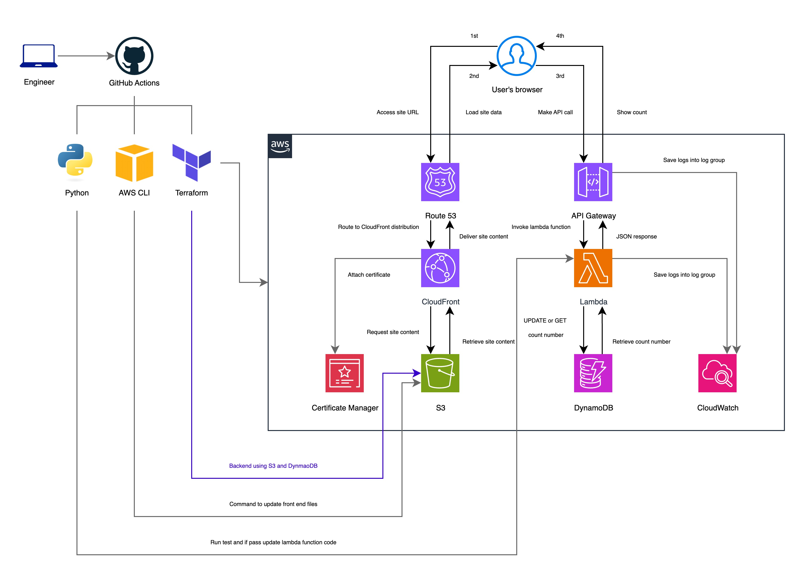

## Terraform Cloud Resume - AWS

[Cloud Resume Challenge - AWS](https://cloudresumechallenge.dev/docs/the-challenge/aws/)

This repository contains my implementation of the Cloud Resume Challenge on AWS, a hands-on cloud project designed to demonstrate real-world skills in cloud architecture, DevOps, and backend services. The Cloud Resume Challenge guides you through building and deploying a personal resume website that integrates a dynamic visitor counter backed by serverless AWS services.

- Project Overview

The goal of this project is to build a production-ready, cloud-hosted resume website that:

Is written in HTML and styled with CSS.

Is deployed as a static website on Amazon S3.

Uses HTTPS via CloudFront and a custom domain to ensure secure access.

Includes a visitor counter that tracks and displays how often the site is visited using a backend API.

Uses a serverless architecture (API Gateway + Lambda) with DynamoDB for persistent visitor count storage.

Applies Python for backend logic and includes automated tests.

Uses Infrastructure as Code (IaC) to define and provision cloud resources.

Implements CI/CD pipelines with GitHub Actions for automated deployments.

- Architecture & Tech Stack

Frontend: HTML, CSS, JavaScript

Static Hosting: Amazon S3 + CloudFront

Custom Domain: DNS configured with Route 53

Backend API: AWS Lambda (Python) + API Gateway

Database: AWS DynamoDB

Infrastructure as Code: Terraform

CI/CD: GitHub Actions automating testing and deployment

- What You’ll Find In This Repo

Frontend code for the static resume site.

Lambda functions written in Python to handle visitor count API requests.

IaC templates (Terraform) for provisioning AWS resources.

Test suites validating backend functionality.

GitHub Actions workflows for automated deployments.

I also wrote a [blog post](https://dev.to/thecodemango/the-cloud-resume-aws-35ca) describing lessons learned and architectural decisions.
